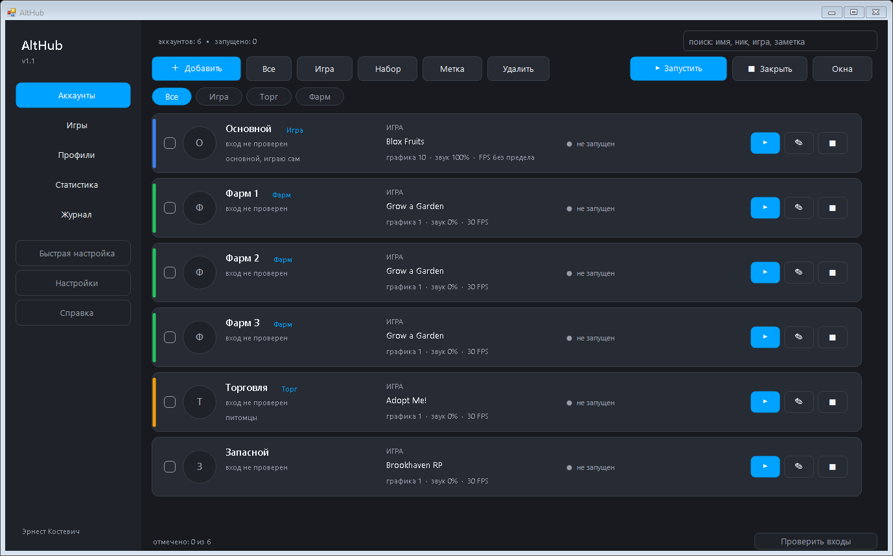
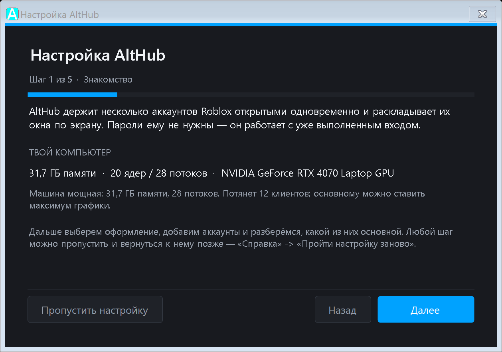
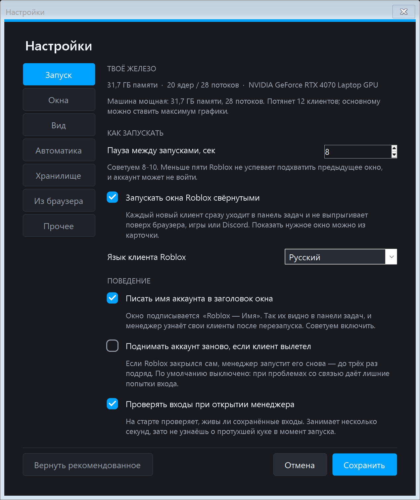
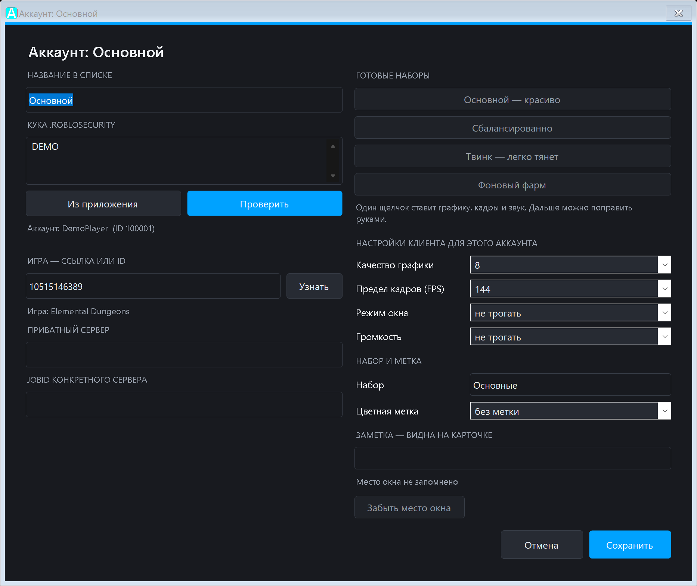
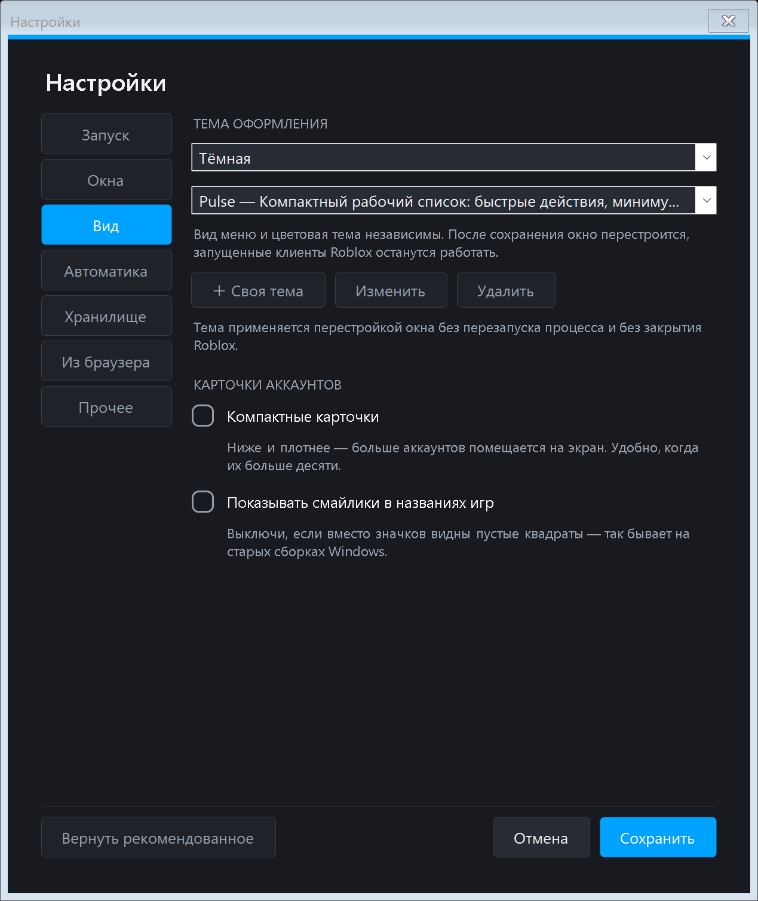
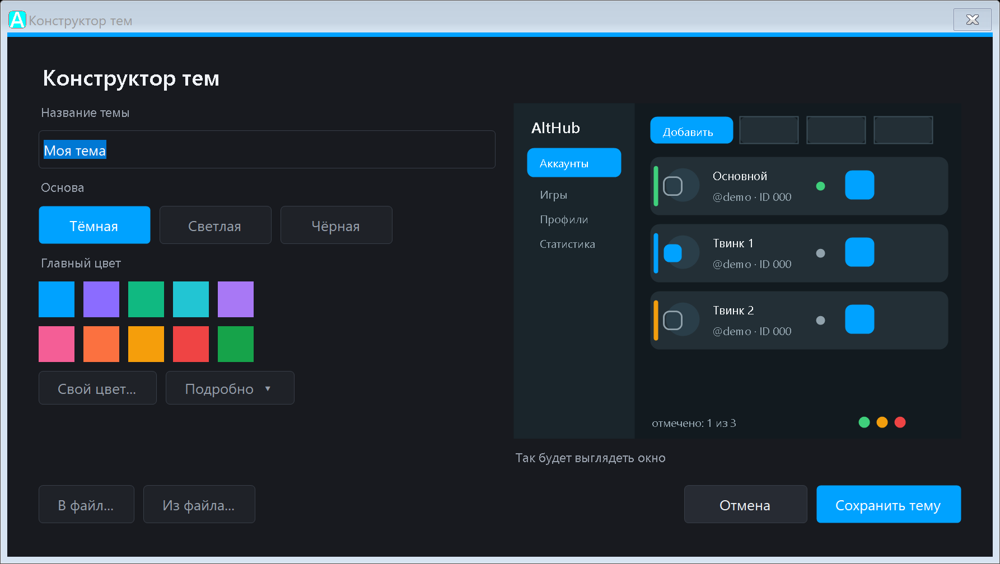

<h1 align="center">AltHub</h1>

<p align="center">
  <b>Менеджер аккаунтов Roblox: несколько аккаунтов одновременно,<br>
  каждый в своём окне, каждый в нужной игре.</b>
</p>

<p align="center">
  
  
  
  
  
</p>

<p align="center"><i>Автор: Эрнест Костевич (Ernest Kostevich)</i></p>



---

## Никаких .exe — только текст, который можно прочитать

Ничего не устанавливается и не компилируется. Это обычные текстовые файлы —
`.ps1` и `.js` — открой любым блокнотом и прочитай сам, строчка за строчкой.
Прямо здесь, на GitHub, не скачивая ничего: жми на любой файл и читай.

Именно поэтому тут нечего нести на VirusTotal: нет ни одного `.exe`, чтобы
антивирус мог на него ругаться. А чтобы не читать всё подряд — в комплекте
есть **`Самопроверка.ps1`**: 66 проверок, которые прогоняются одной кнопкой и
среди прочего печатают полный список адресов, на которые программа вообще
может обратиться, с причиной для каждого.

```
Пройдено 66 из 66 — всё в порядке.
```

**Одна оговорка, и она важная.** Начиная с 1.3 программа умеет скачать ровно
одну вещь — **Chrome for Testing**, официальную сборку Chromium от Google
(~150 МБ), для способа входа «окно браузера». Это происходит **только после
того, как ты нажмёшь кнопку** в окне, где написано, что качается, откуда и
сколько весит. Без этого нажатия в сеть за ним не уходит ни одного запроса, а
все остальные способы добавить аккаунт работают и без него. Поэтому список
адресов теперь такой:

| Адрес | Зачем |
|---|---|
| `roblox.com` и поддомены | сам Roblox |
| `rbxcdn.com` | картинки и аватарки |
| `127.0.0.1` | петля внутри твоего компьютера: мост с расширением браузера |
| `googlechromelabs.github.io` | список сборок Chrome for Testing, только по кнопке |
| `storage.googleapis.com` | сам архив Chrome for Testing, только по кнопке |

Список не на словах: самопроверка разбирает исходники и падает, если появится
хоть один адрес сверх этих.

**Куки никуда не уходят.** Они лежат зашифрованными на твоём диске (DPAPI,
привязка к учётной записи Windows, или AES-256 с твоим паролем) и отправляются
только на серверы Roblox. Ни в какие чужие сервисы, ни в какую аналитику,
никуда больше. Подробно — в разделе «Безопасность» ниже.

---

## Мастер первого запуска

При первом запуске AltHub проводит по пяти шагам: смотрит железо и говорит,
сколько клиентов машина вытянет, даёт выбрать тему, добавить аккаунты любым
из четырёх способов и расставить наборы настроек. Любой шаг пропускается,
вернуться можно из «Справки».



---

## Настройки — по смыслу, с подсказками

Шесть разделов вместо одной простыни. Рядом с каждой настройкой написано,
что она делает и что советуем; внизу — «Вернуть рекомендованное».



---

## Готовые наборы настроек аккаунта

Четыре набора — «Основной, красиво», «Сбалансированно», «Твинк, легко тянет»
и «Фоновый фарм». Один щелчок ставит графику, кадры, звук и режим окна.
Доступны и в окне аккаунта, и по правому клику на карточке.



---

## Внешний вид: 10 готовых тем и конструктор своих

Десять встроенных тем — **Тёмная, Полночь, Изумруд, Океан, Виноград, Роза,
Закат, Чёрная (AMOLED), Светлая, Небо**:



А если ни одна не подошла — собери свою.



**Простой режим.** Выбираешь главный цвет и основу (тёмная, светлая или
чёрная) — остальные 15 оттенков считаются сами так, чтобы всё гарантированно
читалось. Никакой возни: два клика и готово.

**Подробный режим.** Кнопка «Подробно» раскрывает настройку каждого цвета
отдельно: фон, панель, карточка, наведение, выделение, границы, основной и
приглушённый текст, акцент, фон журнала.

Справа всё время живое превью — видно результат сразу, не перезапуская
программу. Готовую тему можно сохранить в файл и отдать другу: он откроет её
кнопкой «Из файла».

> Цвета смысла — зелёный «ок», жёлтый «внимание», красный «опасно» — конструктор
> подбирает сам под выбранную основу. Их нарочно нельзя перекрасить: красная
> кнопка удаления должна читаться как красная в любой теме.

> Аккаунты на скриншотах выдуманы для витрины — это не чьи-то настоящие ники.

---

## Быстрый старт — 5 аккаунтов за 5 минут

Кука (то, чем менеджер входит в аккаунт) забирается **прямо из приложения
Roblox**, в котором ты уже сидишь. Пароли вводить не надо, в браузер лезть
не надо.

1. Двойной клик по **`AltHub.vbs`** — запускается без чёрного окна консоли.
   (Или `Запустить.cmd`, если `.vbs` отключён политикой.) Ярлык на рабочий
   стол делается кнопкой в мастере или файлом `Ярлык на рабочий стол.cmd`.
2. Нажми **«＋ Добавить аккаунты»** — откроется мастер.
3. В приложении Roblox войди под первым аккаунтом.
4. В мастере нажми **«Проверить снова»** → появится ник этого аккаунта.
5. Нажми **«Добавить этот аккаунт»**.
6. Нажми **«Сменить аккаунт (безопасно)»** → открой Roblox, войди под
   следующим аккаунтом → вернись к шагу 4. И так все пять.
7. Закрой мастер кнопкой **«Готово»**.
> **Важно:** сначала открывай менеджер, и только потом запускай через него
> аккаунты. Если Roblox уже открыт до менеджера, мультизапуск не включится —
> подробности ниже, в разделе про мультизапуск.

8. Отметь галочками аккаунты → **«Игра для отмеченных»** → вставь ссылку.
   Или **оставь поле пустым** — тогда Roblox просто откроется под каждым
   аккаунтом, а игру ты выберешь сам уже внутри клиента.
9. Жми **«▶ Запустить»**.

Первый клиент стартует сразу, остальные — через паузу (по умолчанию 8 с),
чтобы Roblox успел подхватить предыдущее окно. Пауза меняется в Настройках.

> ## Никогда не жми «Выйти» в самом Roblox
>
> Эта кнопка аннулирует вход **на сервере Roblox** — то есть убивает ту самую
> куку, которую менеджер уже забрал себе. Аккаунт, добавленный минуту назад,
> сразу перестанет запускаться.
>
> Для смены аккаунта есть кнопка **«Сменить аккаунт (безопасно)»** в мастере.
> Она закрывает Roblox и убирает сохранённый вход **только с диска**, положив
> его в резервную копию. На сервере сессия остаётся живой, забранная кука
> продолжает работать, а приложение показывает экран входа для следующего
> аккаунта. Любую копию можно вернуть кнопкой «Вернуть прошлый вход».

> Если после смены аккаунта мастер всё ещё показывает старый ник — полностью
> закрой приложение Roblox и открой заново, потом «Проверить снова».
> Клиент сохраняет вход на диск не мгновенно.

---

## Восемь способов добавить аккаунт

Кнопка **«＋ Добавить»** открывает экран с тремя главными способами крупными
кнопками и полем, куда можно просто вставить куку или их список. Остальные —
под кнопкой **«Ещё способы»**: выбор не уменьшился, просто перестал мозолить
глаза.

| Способ | Когда удобен |
|---|---|
| **Окно браузера** | Открывается настоящий Chrome, входишь руками. Лучше всего для твинков: пароль остаётся между тобой и Roblox, а капчу, если вылезет, проходишь сам. |
| **Из приложения Roblox** | Пароль не нужен вовсе: вход берётся из приложения, в котором ты уже сидишь. Удобнее всего для основного аккаунта. |
| **Из своего браузера, по клавише** | Ты уже открыл roblox.com под нужным аккаунтом — жмёшь клавишу, и он в списке. Нужно один раз поставить расширение-мост, подробности ниже. |
| **Само предложит** | Сменил аккаунт в приложении Roblox — менеджер это замечает и предлагает добавить его кликом по строке внизу. |
| **Вставить пачкой** | Есть список кук — по строке на аккаунт. Вставил пять, получил пять. Сюда же вставляются ссылки-приглашения. |
| **Из браузера через F12** | Пошаговая подсказка: где найти куку руками. Работает в любом браузере и без расширений. |
| **Вручную** | Вставить куку самому, если она уже где-то у тебя записана. |
| **Перетащить файл** | Брось на окно AltHub список кук или файл настроек — разберёт сам. |

### Вход из твоего браузера, по клавише

Самый быстрый способ, если ты и так сидишь на сайте Roblox. Открыл нужный
аккаунт, нажал **F10** (клавишу можно поменять) — и он в списке. Или нажал
значок AltHub на панели браузера, если мигающая вкладка мешает.

**Почему для этого нужно расширение и нельзя без него.** Кука `.ROBLOSECURITY`
помечена флагом HttpOnly: её не видит ни один скрипт на странице, поэтому
закладкой-букмарклетом её не достать. В файле браузера она лежит зашифрованной
ключом Windows и заперта, пока браузер запущен. Лезть туда — это ровно то, чем
занимаются программы-воришки, и AltHub этого делать не будет. Остаётся один
честный путь: попросить сам браузер отдать её через его же официальный
интерфейс — то есть расширение.

**Ставится руками, один раз**: `chrome://extensions` → «Режим разработчика» →
«Загрузить распакованное» → папка `extension` рядом с программой. В настройках
есть кнопка «Как поставить расширение», которая показывает шаги и путь.
Автоматически поставить его нельзя — и это правильно: Chrome 137 специально
убрал такую возможность у обычных сборок, чтобы программы не подсовывали
расширения молча. Решение о доступе к куке принимает человек.

**Что расширение может.** Читает ровно одну куку — `.ROBLOSECURITY` с
roblox.com — и отправляет её на `127.0.0.1`, то есть запущенному на этом же
компьютере AltHub. Наружу не уходит ничего: других адресов в его коде нет.
Прав на другие сайты, историю и закладки у него нет — это видно в
`manifest.json`, он в той же папке и открывается блокнотом. Всё это проверяется
самопроверкой: она разбирает `extension\*.js` и падает, если появится чужой
адрес или чужая кука.

**Порт занимается, только пока приём включён.** По умолчанию он выключен.

### Почему нет входа по логину и паролю

Он был в одной из сборок, и его пришлось убрать. Roblox закрыл вход
из сторонних программ проверкой **proofofwork** — вычислительной головоломкой
против ботов. Капчу человек может пройти сам, и для этого мы открывали
настоящую страницу Roblox. А головоломку проходит не человек, а программа:
«поддержать» её означало бы обходить защиту от ботов. Этого AltHub не делает
принципиально — именно за такое программы этого рода и попадают в чёрные
списки антивирусов.

Оставлять кнопку, которая всегда отвечает ошибкой, — врать пользователю,
поэтому её нет совсем. Самый простой рабочий способ — «Из приложения Roblox»:
там пароль не нужен вовсе.

### Про «Из браузера» — честно

AltHub **не лезет в хранилище кук браузера**. Так делают стилеры, и антивирусы
ловят это намертво. К тому же с 2024 года Chrome и Edge шифруют куки ключом,
привязанным к самому браузеру — прочитать их снаружи всё равно нельзя, а
попытки обойти защиту выглядят ещё хуже.

Поэтому «Из браузера через F12» — это пошаговая подсказка: открыть Roblox,
нажать F12, скопировать значение `.ROBLOSECURITY` и вставить в поле. Работает в
любом браузере, ничего не расшифровывается за твоей спиной.

Два способа из 1.3 — «окно браузера» и «из своего браузера по клавише» — тоже
не расшифровывают ничего: в первом браузер запускает сам AltHub со своим
отдельным профилем, во втором куку отдаёт расширение через официальный
интерфейс браузера. Разница принципиальная: у нас нет и не будет кода, который
читает чужие файлы браузера.

**И про капчу.** В окне браузера её проходит человек. Никаких разгадывателей,
платных сервисов разгадывания и флагов, прячущих автоматизацию, в коде нет —
это отдельная проверка в самопроверке, и она падает, если такое появится.
Один такой флаг (`--disable-blink-features=AutomationControlled`) в проекте
побывал и был убран: браузером мы не управляем, человек сам печатает пароль,
поэтому флаг ничего не менял — но строка, которая выглядит как обход защиты от
ботов, в этом проекте не нужна даже бесполезная.

### Про ссылку-приглашение

Правый клик по карточке → **«Скопировать приглашение»** упакует аккаунт вместе
с игрой и настройками в одну строку `althub://`.

> **Внутри лежит кука, то есть полный доступ к аккаунту.** Это для переноса
> СЕБЕ на другой компьютер, а не для раздачи. Никому её не отправляй.

---
## Что где лежит

| Файл | Что делает |
|---|---|
| `AltHub.vbs` | Запуск без чёрного окна консоли — им пользуется ярлык |
| `Запустить.cmd` | То же самое, запасной путь |
| `Ярлык на рабочий стол.cmd` | Создаёт ярлык «AltHub» со своей иконкой |
| `Запустить с окном.cmd` | Запуск с видимой консолью — покажет ошибку, если что-то не так |
| `tools\shortcut.ps1` | Собственно создание ярлыка (вызывается из .cmd) |
| `AltHub.ps1` | Точка входа: состояние, журнал, подключение модулей |
| `modules\Storage.ps1` | Шифрование и хранение аккаунтов на диске |
| `modules\RobloxApi.ps1` | **Единственный файл, который ходит в сеть** |
| `modules\CookieImport.ps1` | Читает вход из приложения Roblox |
| `modules\Launcher.ps1` | Мультизапуск и старт клиента |
| `modules\WindowTools.ps1` | Заголовки окон и раскладка сеткой |
| `modules\RobloxSettings.ps1` | Графика, звук и FPS для каждого аккаунта |
| `modules\Presets.ps1` | Железо компьютера и готовые наборы настроек |
| `modules\Hotkeys.ps1` | Глобальные Ctrl+1..9 и значок в часах |
| `modules\Accounts.ps1` | Очередь запуска, наборы, профили, починка входов |
| `modules\Theme.ps1` | Цвета и нарисованные вручную элементы |
| `modules\Layout.ps1` | Раскладчик: ни одной координаты числом |
| `modules\UiMain.ps1` | Главное окно и его разделы |
| `modules\UiDialogs.ps1` | Все диалоговые окна |
| `modules\UiWizard.ps1` | Мастер первого запуска |
| `modules\CookieBridge.ps1` | Приём входа из твоего браузера: локальный порт и горячая клавиша |
| `modules\ExternalBrowserLogin.ps1` | Окно настоящего Chrome для входа руками |
| `extension\` | Расширение-мост: `manifest.json` и `background.js`, оба читаемые |
| `Самопроверка.ps1` | 66 проверок кода, шифрования и вёрстки |
| `Проверка запуска.ps1` | Запускает программу как человек и смотрит, что видно на экране |
| `Запустить с окном.cmd` | Запуск с видимой консолью — чтобы увидеть ошибку, если что-то не так |
| `Проверка входов.ps1` | Проверяет, продлевает ли Roblox вход (см. раздел ниже) |
| `Диагностика.ps1` | Показывает, что отвечает Roblox, если запуск не идёт |
| `LICENSE` | MIT, автор Эрнест Костевич |
| `data\accounts.dat` | Твои аккаунты, **зашифрованы** (создаётся сам) |
| `data\settings.json` | Настройки, ничего секретного |
| `data\avatars\` | Кэш аватарок, картинки, ничего секретного |
| `data\roblox-sessions\` | Резервные копии входов приложения Roblox |
| `data\roblox-settings-backup.xml` | Исходные настройки графики Roblox, для возврата |
| `data\logs\` | Журнал по дням, хранится две недели, кук в нём нет |

---

## Что нового в 1.3

Версия сделана вместе с **H₂O** ([@YarreYT](https://github.com/YarreYT)) — он
разобрал 1.2, написал вход через настоящий Chrome, нашёл причину, по которой
окна Roblox выпрыгивали поверх игры, и сделал перетаскивание карточек видимым.
Спасибо.

### Вход из твоего браузера, по одной клавише

Ты уже открыл roblox.com под нужным аккаунтом — жмёшь **F10**, и он в списке.
Ни F12, ни копирования куки. Подробно, вместе с тем, почему для этого нужно
расширение и почему его нельзя поставить автоматически, — в разделе про способы
добавления выше.

### Окно браузера для входа

Отдельное окно настоящего Chrome, где ты входишь руками и сам проходишь капчу,
если она вылезет. Капча выпадает тем реже, чем обычнее браузер выглядит для
Roblox, поэтому по кнопке можно скачать Chrome for Testing — официальную сборку
Chromium от Google. Это единственное, что программа вообще способна скачать, и
только после нажатия кнопки в окне, где написано, что и откуда качается.

Что в этом способе **не** делается: капча не разгадывается автоматически,
отпечаток браузера не подделывается, прокси не крутятся, и флагов, прячущих
автоматизацию, в коде нет. Последнее — отдельная проверка в самопроверке.

### Окна Roblox больше не выпрыгивают поверх игры

Причину нашёл H₂O. В раскладчике окон для каждого окна безусловно звался
`ShowWindow(SW_SHOWNORMAL)` — а это не «восстановить свёрнутое», это команда
**активировать** окно, то есть поднять его поверх всех и забрать фокус. После
массового запуска все окна по очереди лезли вперёд, включая то, в котором
человек в этот момент играл. Теперь она зовётся, только если окно и правда
свёрнуто.

### Мёртвый вход чинится с карточки

У аккаунта с умершим входом кнопка «пуск» бесполезна — клиент откроется и
выкинет на страницу входа. Вместо неё теперь стоит «войти заново»: свежая кука
встаёт на место старой, а игра, набор, метка и место в списке остаются
прежними. Продлить куку по-прежнему нечем — это проверено и описано ниже, —
но перелогиниться стало делом одного клика.

### Интерфейс пережил и масштаб, и узкое окно

Отдельная беда, на которую указал H₂O: «программа не рассчитана на то, чтобы её
уменьшали». Так и было. Половина окна держалась на числах, вписанных под
масштаб 100% и широкое окно: высоты кнопок, шаг бокового меню, колонки в
карточке, ширина полос с кнопками. При 125% и 150% шрифт рос, а числа — нет.
Отсюда и обрезанная «Удалить», и пропавшее название игры, и наехавшие друг на
друга пункты меню, и карточки, уезжавшие за правый край при сужении окна.

Исправлено не по одному месту, а разом: размеры считаются от шрифта и от
фактических размеров соседей. И чтобы это не расползлось снова, самопроверка
теперь собирает все окна на 100%, 125% и 150%, обходит каждый элемент и падает,
если хоть один вылез за свой контейнер или не вместил надпись.

### Меню выбора раскладки окон было пустым

Пять пунктов правого клика по кнопке «Окна» состояли из пустых строк, а клик по
любому из них записывал в настройки пустой режим. Причина глупая: когда-то по
файлу прошлись заменой `$m.` на `$metrics.`, и в этом цикле она сработала не по
адресу.

### Проверок стало 66

Новые запирают всё, что появилось: расширение стучит только на `127.0.0.1` и
читает только `.ROBLOSECURITY`; Chrome for Testing не качается ниоткуда, кроме
окна согласия; порт не занимается, пока приём выключен; в коде нет флагов,
прячущих автоматизацию; кнопки главного окна не заданы числами.

---

## Что нового в 1.2

### Программу больше нельзя потерять

Главное и самое стыдное. Три выпуска подряд у людей случалось одно и то же:
свернул или закрыл — и программы нигде нет. Причина оказалась глубже, чем
выглядела.

**Окно жило внутри `ShowDialog()`**, а этот вызов завершается не только когда
окно закрыли, но и когда его **прячут**. Любая попытка убрать программу в часы
выходила из цикла сообщений, скрипт доходил до конца, и процесс завершался.
Со стороны это и выглядело как «свернул, а оно закрылось». Теперь окно живёт
в обычном `Application.Run`, который переживает скрытие спокойно.

Дальше — три страховки, чтобы это не повторилось никаким другим способом:

- **Минус всегда сворачивает в панель задач.** Настройки «куда девать по
  минусу» больше нет: выбирать тут нечего, а именно она людей и теряла.
- **Крестик убирает в часы — но только с твоего подтверждения.** Программа
  показывает значок и спрашивает прямо: «Видишь его рядом с часами?» Ответил
  «нет» — крестик просто закрывает. Узнать это у Windows нельзя: она отвечает
  «значок показан» и когда он уехал под стрелку `^` и человеку не виден.
- **Повторный запуск возвращает окно, а не открывает вторую копию.** Раньше
  вторая копия висела рядом с потерянной первой и отбирала у неё горячие
  клавиши. Теперь клик по ярлыку всегда поднимает уже работающую программу —
  что бы ни случилось с окном.

### Вход по логину и паролю убран

Roblox закрыл его проверкой **proofofwork** — вычислительной головоломкой
против ботов. Капчу человек может пройти сам, и мы для этого открывали
настоящую страницу Roblox. Головоломку проходит не человек, а программа —
то есть «поддержать» её означало бы обходить защиту от ботов. Этого мы не
делаем, поэтому кнопка убрана совсем, а не оставлена вечно выдавать ошибку.

Рабочие способы остаются: из приложения Roblox (пароль не нужен вовсе),
пачкой, из браузера через F12, файлом и ссылкой-приглашением. Плюс менеджер
сам замечает смену аккаунта в приложении и предлагает добавить его в один клик.

### Появилась проверка, которая ловит то же, что и человек

Самопроверка гоняла код и собирала окна «вхолостую», не показывая их — и была
зелёной, пока программа не открывалась у людей с первого клика. Такой класс
ошибок она увидеть не могла в принципе.

Теперь рядом лежит **`Проверка запуска.ps1`**: он запускает программу так же,
как человек — двойным кликом по `AltHub.vbs` — и смотрит глазами Windows:

```
OK   Окно появляется после двойного клика по AltHub.vbs
OK   Чёрного окна консоли нет
OK   Минус сворачивает окно, а не прячет его
OK   Второй запуск возвращает окно, а не открывает копию
OK   Крестик не оставляет программу без следа
```

Гоняется на распакованном архиве — ровно на том, что скачивают люди.

---
### Остальное из этой же версии

**Запуск как у нормальной программы.**

- **`AltHub.vbs`** — запуск вообще без чёрного окна консоли. Обычный текстовый
  файл в три строки, открывается блокнотом.
- **Ярлык на рабочем столе** — кнопка в мастере первого запуска или файл
  `Ярлык на рабочий стол.cmd`.
- **Своя иконка** в заголовке и в панели задач вместо безымянного значка
  PowerShell. Двоичных файлов в репозитории по-прежнему нет: `.ico` рисуется
  на твоей машине при первом запуске.

**Добавлять аккаунты проще.**

- **Менеджер сам замечает**, что в приложении Roblox сменился аккаунт, и
  предлагает добавить его одним кликом по строке внизу. Ничего не выскакивает
  поверх игры.
- **Вход по логину и паролю пробовали и убрали.** Roblox закрыл его проверкой
  proofofwork — подробности выше, в разделе про способы добавления.

**Очередь запуска.**

- Порядок в списке теперь и правда задаёт очередь запуска. Раньше список
  сортировался по своему полю, а очередь бралась в порядке хранения — и
  аккаунт, добавленный последним, запускался последним, хотя в списке стоял
  третьим.

---

## Почему входы всё-таки «ложатся»

Это спрашивают чаще всего, поэтому отвечаю прямо, с проверкой, а не по слухам.

Расхожее мнение: Roblox продлевает вход, если к нему регулярно обращаться, и
достаточно раз в час куда-нибудь сходить. **Мы это проверили** — в комплекте
есть **`Проверка входов.ps1`**: он обходит обычные запросы на твоём же аккаунте
и смотрит, прислал ли Roblox новую `.ROBLOSECURITY`.

Результат на живых аккаунтах: **ни один запрос куку не продлил.**

```
кто я                код 200  новой куки нет
сколько Robux        код 200  новой куки нет
есть ли Premium      код 200  новой куки нет
мои настройки        код 200  новой куки нет
главная страница     код 200  новой куки нет
```

Значит обещать «входы больше не будут вылетать» нельзя: это сторона Roblox, и
снаружи на неё не влияют. Рабочее средство одно — красная кнопка **«Починить
входы»** внизу справа: она забирает свежий вход из приложения Roblox. При
открытии менеджера он и так молча пробует починить то, что может.

Прогони `Проверка входов.ps1` сам, если не веришь — запросы только на чтение,
куки в выводе не показываются.

---

## Что было в 1.1

- **Мастер первого запуска** — пять шагов: железо, тема, аккаунты, кто
  основной, готово.
- **Готовые наборы настроек аккаунта** и **подбор под железо**.
- **Перестало падать**: глобальный перехватчик аварий, запуск больше четырёх
  аккаунтов, подхват уже открытых клиентов после перезапуска.
- **Вся вёрстка на раскладчике** — ни одной координаты числом, проверка на
  100/125/150%.
- **Конструктор своих тем**, десять встроенных тем, различимые светлые.
- `AltHub.ps1` разбит по смыслу на модули.

---

## Возможности

- **Добавление одной кнопкой** — забирает вход из открытого приложения Roblox.
- **Карточки с аватарками** — видно, кто есть кто, и что сейчас запущено.
- **Игра для отмеченных** — назначить одну игру сразу нескольким аккаунтам.
- **Запуск без игры** — если игра не задана, клиент просто откроется под нужным
  аккаунтом на главной, дальше выбираешь сам.
- **Ссылки «Поделиться»** — новый формат `roblox.com/share?code=...&type=Server`
  распознаётся и разворачивается автоматически.
- **Мультизапуск** — несколько окон Roblox одновременно.
- **Имя аккаунта в заголовке окна** — не перепутаешь, где кто.
- **Пять раскладок окон** — сеткой, каскадом, колонками, строками и
  «основной крупно, твины мелко». Правый клик по кнопке «Окна».
- **Приватный сервер** — вставь ссылку-приглашение в карточку аккаунта.
- **Конкретный сервер** — вставь `JobId` (GUID сервера).
- **Смена аккаунта без разлогина** — забранные куки не умирают.
- **Мои игры** — использованные игры запоминаются, в следующий раз выбираются
  из списка, а не вставляются ссылкой заново.
- **Всегда свежий клиент** — запускается самая новая установленная версия
  Roblox, даже если реестр ещё указывает на старую.
- **Десять встроенных тем плюс свои** — конструктор с любым цветом акцента.
- **Проверить куки** — одной кнопкой видно, какие входы живы.
- **Диагностика** — если Roblox отказывает, видно точный код ответа.
- **Свои настройки на каждый аккаунт** — графика, FPS, громкость и режим окна.
  Основному максимум, твинам минимум — пять окон перестают душить компьютер.
- **Наборы аккаунтов** — «Фарм», «Торговля»; фильтр по набору одним кликом.
- **Цветные метки и заметки** — видно, кто есть кто, прямо в списке.
- **Своё место окна у каждого аккаунта** — запомнил один раз, дальше окна
  встают туда же сами.
- **Перетаскивание мышью** — порядок в списке меняется как удобно, он же
  задаёт очередь запуска.
- **Статистика** — сколько запусков, вылетов, сколько наиграно, когда был
  последний вход.
- **Автозапуск по расписанию** — набор поднимается в заданное время сам.
- **Разделы слева** — Аккаунты, Игры, Профили, Статистика, Журнал.
- **Мастер первого запуска** — пять шагов от пустого списка до готовой работы.
- **Готовые наборы настроек** — «Основной», «Сбалансированно», «Твинк»,
  «Фоновый фарм»; один щелчок вместо четырёх выпадающих списков.
- **Подбор под железо** — сколько клиентов вытянет именно твой компьютер.
- **Компактный режим** — вдвое ниже карточки, больше аккаунтов на экране.
- **Горячие клавиши** — Ctrl+F поиск, Enter запуск, Ctrl+A отметить всё,
  Ctrl+T разложить окна, Ctrl+Z отменить, Delete удалить, F5 обновить,
  1-4 разделы.
- **Правый клик по карточке** — меню действий для одного аккаунта: запустить,
  задать игру, настройки, починить вход, показать или закрыть окно, убрать.
  Галочки для этого ставить не надо.
- **Отмена последнего действия (Ctrl+Z)** — возвращает список аккаунтов к тому,
  что было до последней пачечной правки: назначения игры, набора, метки,
  удаления, быстрой настройки. Помнит 10 шагов назад.
- **Живая строка внизу** — всё время показывает, сколько отмечено, кто в игре,
  что в очереди и через сколько секунд, сколько входов мёртвых и что вернёт
  Ctrl+Z.
- **Быстрая настройка** — одна кнопка раскладывает всё под обычный расклад:
  основным играешь, твины стоят на випке. Основному графика 10 и звук, твинам
  графика 1, звук 0 и 30 кадров, окна «основной крупно — твины мелко»,
  профиль «Твины на випку» в придачу.
- **Профили запуска** — связка «набор + игра». Одной кнопкой ставит игру всем
  и запускает: «Фарм в Elemental Dungeons», «Все в Blox Fruits».
- **Ctrl+1..9 переключают окна** — работает прямо из игры, не надо жать Alt+Tab
  по пять раз.
- **Значок в часах** — по крестику окно уходит туда и не мешает, программа
  продолжает работать. Правый клик по значку — быстрый запуск профиля или
  набора без открытия окна, там же «Выход». Кнопка «свернуть» при этом всегда
  сворачивает в панель задач, чтобы окно нельзя было потерять.
- **Присмотр за набором** — вылетел аккаунт, менеджер поднял его сам.
- **Свежую куку подхватываем, если Roblox её пришлёт** — механизм есть, но
  честно: на тех запросах, которые делает AltHub, Roblox её не присылает.
  Проверено, см. раздел «Почему входы всё-таки ложатся». Считать это
  средством от умирающих входов нельзя.
- **Проверка входов при открытии** — узнаёшь о мёртвой куке до того, как
  нажал «Запустить», а не после. Что можно, чинится само.
- **Починка мёртвых входов** — заметил, что кука умерла, забрал свежую из
  приложения Roblox. Работает и молча посреди пачки запусков.
- **Robux, Premium и дата регистрации** — видно прямо на карточке, заходить
  в игру не надо. Обновляется кнопкой состояния входов внизу справа.
- **Журнал в файл** — `data\logs\ГГГГ-ММ-ДД.log`, чтобы разобрать, что было
  ночью. Куки туда не попадают, они вырезаются до записи.
- **Смайлики в названиях игр** — рисуются настоящими картинками; можно
  выключить галочкой в Настройках, тогда они просто вычищаются.
- **Мастер-пароль** — по желанию, вместо привязки к учётке Windows.

---

## Настройки графики и звука для каждого аккаунта

Roblox хранит настройки клиента в одном общем файле:

```
%LOCALAPPDATA%\Roblox\GlobalBasicSettings_13.xml
```

Файл **один на все окна**. Поэтому AltHub делает так: прямо перед стартом
очередного клиента он записывает туда настройки именно этого аккаунта, клиент
читает их при запуске и дальше держит у себя. Следующий стартует уже со
своими. Это работает, но накладывает два ограничения:

1. менять настройки внутри уже запущенного Roblox не стоит — при выходе он
   запишет их обратно в общий файл;
2. если у аккаунта не задано ничего, файл **вообще не трогается** — клиент
   стартует с твоими обычными настройками.

Перед самой первой записью исходный файл откладывается в
`data\roblox-settings-backup.xml`, и **твои настройки возвращаются сами**:

- если запуск сорвался — сразу же, чтобы в общем файле не остались чужие
  настройки;
- когда все окна Roblox закрыты — тоже автоматически.

Так обычный запуск Roblox мимо менеджера всегда получает твои настройки, а не
графику последнего запущенного твина. Кнопка «Вернуть настройки Roblox как
было» в Настройках делает то же самое вручную.

Что можно задать на аккаунт: качество графики (Авто или 1–10), предел кадров,
громкость (0–100%) и режим окна. Типовой расклад: основному графика 10 и звук,
твинам графика 1, звук 0 и 30 FPS.

### Почему графика основного иногда сбрасывалась (исправлено в 1.1)

Симптом был такой: у основного стоит графика 10, у твинков 1, но при запуске
всех сразу основной **иногда** оказывался на графике 1.

Причина — в том самом общем файле. Настройки пишутся туда прямо перед стартом
клиента, а клиент читает их не мгновенно: где-то в первые секунды загрузки.
Пауза между запусками — 8 секунд, и твинк успевал перезаписать файл раньше,
чем основной его дочитывал. Когда машина шустрее, основной успевал — отсюда
«иногда».

Теперь AltHub перед записью настроек следующего аккаунта **дожидается, пока у
предыдущего клиента появится окно** — это верный признак, что свои настройки
он уже прочитал. Ждём только когда настройки соседних аккаунтов реально
отличаются: пять одинаковых твинков запускаются с прежней скоростью.

---

## Почему вход «вылетает» и что с этим сделано

Честно, без обещаний, которых программа не выполняет.

**Что сделано.** Если Roblox присылает новую `.ROBLOSECURITY` в заголовке
`Set-Cookie`, AltHub её подхватывает и сохраняет в аккаунт — как это делает
браузер. Заголовки при этом не склеиваются через запятую: внутри встречается
`expires=Wed, 01 Jan ...`, и склейка ломала разбор. Дальше: при открытии
менеджера все входы проверяются и мёртвые по возможности чинятся из приложения
Roblox молча, а если вход умер посреди запуска — AltHub пробует починить его и
повторить, не останавливая очередь.

**Чего это НЕ лечит.** По журналам видно, что на тех запросах, которые делает
AltHub, Roblox свежую `.ROBLOSECURITY` не присылает вообще — строка «Roblox
обновил вход» не появилась ни разу. То есть подхват работает, но лечит он не
тот случай, который встречается на практике. Полагаться на него как на средство
от «входы умирают» нельзя.

**Что убивает вход насмерть.** Кнопка **«Выйти»** в самом Roblox или в браузере
и смена пароля — это точно и починить нельзя. Для смены аккаунта в приложении
пользуйся кнопкой «Сменить аккаунт (безопасно)» в мастере: она убирает вход
из приложения, не разлогинивая его на сервере.

**Что остаётся непонятным.** Входы иногда умирают и без всего этого — судя по
всему, Roblox сам закрывает старые сессии, когда на том же устройстве заходишь
под другим аккаунтом. Проверить это, не рискуя живыми аккаунтами, не получилось,
поэтому здесь честно написано «непонятно», а не выдумана красивая причина.

**Что с этим делать на практике.** Держать кнопку «Починить входы» под рукой —
она внизу справа и сама краснеет, когда чинить есть что. Починка занимает
столько же, сколько зайти в аккаунт: войти в приложении Roblox и нажать одну
кнопку. Заводить аккаунт заново при этом не нужно — сохраняются игры, набор,
метка, настройки графики и статистика.

### Кнопка состояния входов

Внизу справа, всегда на одном месте. У неё два вида:

- **«Проверить входы»** — тихая, когда всё живо. Обходит аккаунты и проверяет,
  принимает ли Roblox сохранённые входы.
- **«Починить входы (N)»** — красная, когда есть мёртвые. N — сколько их.

Раньше она пряталась, когда чинить нечего, и от этого дёргалась: появлялась
и исчезала на каждом обновлении списка. Теперь она просто меняет вид.

В режиме починки она проводит по всем мёртвым входам подряд. По каждому сначала пробует молча
забрать куку из приложения Roblox — вдруг там уже сидит нужный аккаунт. Если
нет, показывает, что делать, и ждёт:

- **Забрать вход** — ты вошёл в приложении под нужным аккаунтом, забираем;
- **Сменить аккаунт** — Roblox закрывается и забывает вход, **не разлогинивая
  его на сервере**, чтобы войти под следующим;
- **Пропустить** — этот пока оставить;
- **Хватит** — закончить, остальные не трогать.

Так пять входов чинятся за один заход, а не пятью открытиями мастера. То же
самое для одного аккаунта — правым кликом по его карточке.

### Раскладка окон ждёт, пока окна появятся

Клиент Roblox создаёт окно на несколько секунд позже, чем стартует процесс.
Раскладка сразу после запуска последнего аккаунта попадала в этот промежуток —
и каждый раз раскладывала на одно окно меньше, чем запущено (в журнале было
видно: запущено 5, «разложены 4 шт.»).

Теперь после запуска пачки AltHub ждёт, пока окна появятся у всех, и только
потом раскладывает. Если какой-то клиент так и не показал окно, через 25 секунд
раскладываются остальные, а в журнале пишется, скольких не дождались.

---

## Горячие клавиши

| Клавиши | Что делает |
|---|---|
| `Ctrl+1` … `Ctrl+9` | Вывести наверх окно N-го аккаунта — **работает из игры** |
| `Ctrl+F` | Поиск по аккаунтам |
| `Enter` | Запустить отмеченные |
| `Ctrl+A` | Отметить все |
| `Ctrl+T` | Разложить окна |
| `Ctrl+Z` | Отменить последнее действие со списком аккаунтов |
| `Delete` | Убрать отмеченные из менеджера |
| `F5` | Обновить список |
| `1` … `4` | Разделы слева |
| `Esc` | Сбросить поиск |

`Ctrl+1..9` работают глобально: Windows сама присылает сообщение, когда нажато
именно это сочетание. Никаких перехватов клавиатуры и хуков на чужие процессы —
нажатия вообще не читаются, приходит только факт «нажали наше сочетание».
Если сочетание уже занято другой программой, Windows откажет, и в журнале
будет видно, сколько клавиш удалось занять.

---

## Безопасность — что именно тут происходит

### Куда уходят данные

`modules\RobloxApi.ps1` — единственный файл со сетевыми вызовами. Полный
список адресов:

```
https://auth.roblox.com/v1/authentication-ticket/       получить билет входа
https://users.roblox.com/v1/users/authenticated         узнать ник по куке
https://apis.roblox.com/sharelinks/v1/resolve-link      разобрать ссылку «Поделиться»
https://apis.roblox.com/universes/v1/places/...         узнать universeId игры
https://games.roblox.com/v1/games?universeIds=...       узнать название игры
https://economy.roblox.com/v1/users/{id}/currency       сколько Robux
https://premiumfeatures.roblox.com/v1/users/...         есть ли Premium
https://users.roblox.com/v1/users/{id}                  дата регистрации
https://thumbnails.roblox.com/v1/users/avatar-headshot  адрес аватарки
https://tr.rbxcdn.com/...                               сама картинка аватарки
```

Кука уходит только туда, где нужна: билет запуска, «кто я», разбор ссылки
«Поделиться», Robux и Premium. Всё это — запросы к **твоему же** аккаунту,
и все они только на чтение. К аватаркам и к
названиям игр она не отправляется, это публичные данные.

Если поискать `http` по всем файлам, найдётся ещё два адреса — вот они,
чтобы не было вопросов:

- `https://www.roblox.com/` — подставляется в заголовки `Referer` и `Origin`,
  запросов туда не идёт;
- `https://assetgame.roblox.com/game/PlaceLauncher.ashx` — **менеджер по нему
  не ходит**. Этот адрес вставляется внутрь строки запуска, и по нему потом
  стучится сам клиент Roblox, чтобы узнать адрес игрового сервера. Ровно так
  же работает кнопка «Play» на сайте.

Никаких своих серверов, никакого GitHub, никакой телеметрии, никаких
«проверок обновлений».

### Откуда берётся кука и почему это не «взлом»

Клиент Roblox сам хранит твой вход здесь:

```
%LOCALAPPDATA%\Roblox\LocalStorage\RobloxCookies.dat
```

Устройство файла:

1. обычный JSON: `{ "CookiesVersion": "1", "CookiesData": "<base64>" }`;
2. внутри base64 — блоб, зашифрованный **DPAPI на твою учётную запись
   Windows**;
3. внутри — куки в формате Netscape: поля через табуляцию, записи через `; `.

Менеджер просит у Windows расшифровать этот блоб — и Windows отдаёт его,
потому что это твоя же учётка на твоём же компьютере. Никакого подбора,
никакого обхода защиты: то же самое делает любая программа, которая читает
свои собственные сохранённые данные.

Обычно файл только читается. Единственное исключение — кнопка «Сменить
аккаунт (безопасно)»: она копирует файл в `data\roblox-sessions\` и убирает
оригинал, чтобы приложение забыло вход, не разлогинивая тебя на сервере.
Испортить его или перезаписать чужими данными нельзя, любая копия
возвращается обратно одной кнопкой.

Отсюда же следует главное: **на чужом компьютере или под чужой учёткой
Windows этот файл не расшифруется**. Ни у кого, включая тебя.

### Перенос настроек в файл

Кнопка «Выгрузить в файл» в Настройках сохраняет файл **у тебя на диске**.
Никуда он сам не отправляется — ни на какие серверы, ни кому-либо ещё.

Внутри только названия аккаунтов, наборы и игры. **Кук там нет**, это
проверяется автотестом: если в выгрузке вдруг окажется что-то похожее на куку,
файл просто не создастся. Войти в твои аккаунты по этому файлу нельзя.

Нужен он для двух вещей: перенести настройку на другой компьютер и, если
захочешь, поделиться раскладкой с другом — но это твой выбор, а не что-то
автоматическое.

### Как хранятся куки в самом менеджере

Файл `data\accounts.dat` зашифрован. Открытым текстом там нет ничего —
это проверяется автотестом. Два режима на выбор:

**DPAPI** (по умолчанию, ничего вводить не надо)
Ключ выдаёт Windows и привязывает к твоей учётной записи. Файл,
скопированный на другой ПК или открытый другим пользователем Windows,
не расшифруется никак. Плюс своя дополнительная «соль» из исходника, так
что даже под твоей учёткой чужая программа файл не развернёт.
Минус: переустановил Windows — данные потеряны. Не страшно, добавишь заново.

**Мастер-пароль** (Настройки → «Включить мастер-пароль»)
AES-256-CBC + HMAC-SHA256 (encrypt-then-MAC), ключ из пароля через
PBKDF2-SHA256, 200 000 итераций. Файл переносится на другой ПК, но пароль
спрашивается при каждом запуске. Неверный пароль и подмена байта в файле
отсекаются по HMAC ещё до расшифровки.

### Что программа НЕ делает

- Не спрашивает логин и пароль от Roblox. Никогда и нигде.
- Не пишет куки в журнал. Всё, что похоже на `.ROBLOSECURITY`, режется перед
  выводом (`Write-RamLog` в `AltHub.ps1`).
- Не лезет в память процесса Roblox, не ставит хуки, не грузит драйверы,
  не патчит файлы клиента. Запускает твой уже установленный
  `RobloxPlayerBeta.exe` и двигает окна обычными функциями `user32.dll` —
  то же самое делает Alt+Tab.
- Не изменяет файлы Roblox — хранилище кук клиента открывается только на чтение.
- Не использует популярный трюк «POST на `/v2/logout` ради CSRF-токена».
  Он при неудачном стечении реально разлогинивает аккаунт и убивает куку.
  Здесь CSRF берётся с безобидного эндпоинта.

### Почему у скачанного менеджера была куча детектов

Обычная история для таких программ: скомпилированный `.NET`-файл + работа
с куками + запуск чужих процессов = эвристики антивирусов срабатывают
пачками, там очень много ложных срабатываний. Но проверить чужой `.exe`
ты всё равно не можешь, а этот код можешь прочитать целиком за полчаса —
так что решение написать своё было нормальным.

---

## Как работает мультизапуск

Тут два замка, и оба надо взять **до того, как запустится первый Roblox**.

**Замок 1 — `ROBLOX_singletonMutex`.** Классическая одиночная блокировка
клиента. Менеджер создаёт этот мьютекс первым и держит, пока открыт.

**Замок 2 — `ROBLOX_singletonEvent`.** Вот здесь главное, и именно на этом
ломаются самодельные менеджеры (мой в первой версии тоже ломался).

На нынешних версиях клиента одного мьютекса **не хватает**. Уже открытый
Roblox *ждёт* на этом событии, а каждый новый клиент его *взводит*. Получив
сигнал, старый клиент закрывает своё окно — поэтому со стороны выглядит так,
будто «открывается только один аккаунт»: на самом деле каждый следующий
закрывает предыдущего. В логе самого Roblox это видно дословно:

```
[FLog::WndProcessCheck] ... EventWaitResultUpdate
[FLog::Systray] Main thread: Received close main window request
```

Просто «держать» событие бесполезно — его именно взводят. Поэтому менеджер
занимает **это же имя мьютексом**: в Windows пространство имён объектов ядра
общее для всех типов, так что после этого Roblox не может ни создать событие,
ни открыть его — подать команду «закройся» ему становится нечем.

Оба замка — штатные вызовы `CreateMutex`. Никакого вмешательства в процесс
Roblox, никакой инъекции в память, никаких драйверов. Замки держатся только
пока открыт менеджер; закроешь его — уже открытые окна продолжат работать,
потому что проверка бывает только в момент старта нового клиента.

### Отсюда одно важное правило

**Сначала менеджер, потом Roblox.** Если хоть одно окно Roblox открылось
раньше менеджера, имя `ROBLOX_singletonEvent` уже занято настоящим событием,
и второй замок взять не получится. Менеджер это замечает и при запуске сам
предложит закрыть все окна Roblox — соглашайся, иначе останется одно окно.

### Какие ссылки понимает поле «Игра»

| Что вставил | Что происходит |
|---|---|
| пусто | Roblox просто откроется под этим аккаунтом, игру выберешь сам |
| `123456789` | обычный вход в игру |
| `roblox.com/games/123456789/Name` | то же самое, ID берётся из ссылки |
| `...?privateServerLinkCode=XXX` | вход на приватный сервер |
| `roblox.com/share?code=...&type=Server` | см. ниже |
| `JobId` (GUID) в отдельном поле | вход на конкретный сервер |

Ссылка **«Поделиться»** — новый формат Roblox. В ней самой нет ни ID игры,
ни кода сервера: там только код приглашения, а что за ним стоит — знает
только сервер Roblox. Поэтому менеджер спрашивает у него напрямую
(`POST /sharelinks/v1/resolve-link`) и подставляет в поля настоящий ID игры
и код приватного сервера. Запрос требует авторизации, поэтому нужен хотя бы
один уже добавленный аккаунт — берётся его кука, то есть твоя же.

Если ссылка протухла, Roblox так и ответит, и менеджер это покажет.
Запасной путь всегда есть: открой такую ссылку в браузере — она приведёт
на страницу игры, и оттуда можно скопировать обычный адрес.

### Запуск игры

Та же последовательность, что и у кнопки «Play» на сайте Roblox:

1. `POST authentication-ticket` без CSRF → приходит `403` и заголовок
   `x-csrf-token`;
2. тот же запрос с этим токеном → приходит заголовок
   `rbx-authentication-ticket` — одноразовый билет входа, живёт меньше минуты;
3. собирается строка `roblox-player:1+launchmode:play+gameinfo:<билет>+...`;
4. эта строка передаётся аргументом в `RobloxPlayerBeta.exe`.

Если игра не задана, шаги те же, но в строке стоит `launchmode:app` вместо
`launchmode:play` и нет адреса игры — клиент открывается на главной, но уже
под нужным аккаунтом. Вход в аккаунт в обоих случаях один и тот же, по билету.

Билет берётся непосредственно перед стартом каждого клиента — потому и нужна
пауза между запусками, а не «все разом».

---

## Если что-то не так

**Ничего не открылось после `Запустить.cmd`**
Консоль скрыта специально, но ошибки старта показываются окном. Если совсем
тихо — запусти вручную и посмотри текст:
```powershell
powershell -NoProfile -ExecutionPolicy Bypass -STA -File "D:\macro\AltHub\AltHub.ps1"
```

**Мастер показывает старый ник после смены аккаунта**
Полностью закрой приложение Roblox (не сверни, а закрой) и открой заново.
Клиент сбрасывает вход на диск не сразу.

**«Не вижу входа в приложении Roblox»**
Войди в приложении Roblox под любым аккаунтом хотя бы раз. Если не помогает —
в мастере есть кнопка «Ввести куку вручную»: там же в диалоге кнопка
«Взять из приложения Roblox», а совсем в крайнем случае куку можно достать
из браузера (F12 → Application → Cookies → `https://www.roblox.com` →
`.ROBLOSECURITY`).

**«Кука недействительна или протухла»**
Почти всегда причина одна: где-то была нажата кнопка **«Выйти»** — в самом
Roblox или в браузере. Она убивает вход на сервере. Добавь аккаунт заново
через мастер, а для смены аккаунтов пользуйся кнопкой «Сменить аккаунт
(безопасно)».

**Запускается не всё — например 4 аккаунта из 5**
Скорее всего, Roblox ограничил частоту запросов: на каждый запуск уходит
обращение к `auth.roblox.com` за одноразовым билетом, и пять подряд он может
не дать. Что AltHub делает сам:

- держит CSRF-токен в памяти 20 минут, чтобы не спрашивать его каждый раз;
- при ответе «слишком часто» ждёт и повторяет до трёх раз;
- если токен протух — обновляет и пробует снова.

Если всё равно не хватает — увеличь **паузу между запусками** в Настройках
до 12–15 секунд. В журнале будет видно точную причину по каждому аккаунту.

**«Кука рабочая, но Roblox отказал…»**
Значит, аккаунт живой, а сервер по какой-то причине не выдаёт билет запуска.
Запусти `Диагностика.ps1` — она покажет точные коды ответов. Куки в её выводе
нет, его можно спокойно копировать и показывать.

**Окна закрываются сами через несколько секунд после запуска**
Скорее всего, Roblox обновился. Старый клиент, запустившись, сам дёргает
установщик, а тот закрывает все открытые окна Roblox. Выглядит один в один
как поломка мультизапуска, но причина другая.

AltHub с этим справляется сам: он выбирает клиент **по версии самого файла**,
а не по реестру — реестр Roblox обновляет с задержкой. В журнале при этом
появится строка «Roblox обновился: в реестре ещё старая версия…». Если
обновление идёт прямо сейчас, AltHub откажется запускать и скажет подождать.

Проверить вручную, какая версия берётся, можно `Самопроверка.ps1` —
там есть строка «Клиент Roblox — берётся самая новая версия».

**Открывается только одно окно / каждый новый закрывает предыдущий**
Если дело не в обновлении, то причина одна: **Roblox был открыт раньше
менеджера**.
- Закрой все окна Roblox, потом открой менеджер, потом запускай аккаунты.
  Менеджер и сам предложит закрыть окна — просто согласись.
- В журнале должна быть строка «Мультизапуск включён: оба замка взяты».
  Если там «Roblox был открыт ДО менеджера» — это оно.
- Не закрывай менеджер, пока запускаешь аккаунты: замки держит он.
- Увеличь паузу между запусками до 12–15 с в Настройках.
- Если у тебя Roblox из Microsoft Store — с ним мультизапуск не работает,
  нужна обычная версия с `roblox.com`. Программа предупредит об этом в журнале.

**Заголовки окон не переименовываются**
Клиент иногда возвращает своё название обратно. Менеджер переставляет
заголовок каждые 2 секунды, так что обычно устаканивается. На игру это никак
не влияет — можно выключить в Настройках.

**Roblox обновился и мультизапуск сломался**
Такое возможно: Roblox время от времени меняет проверку. Чинить в
`modules\Launcher.ps1`, функция `Enable-RamMultiInstance`. Как искать причину:
запусти два клиента, дай старому закрыться и загляни в его лог в
`%LOCALAPPDATA%\Roblox\logs\` — там будет видно, что именно дало команду
на выход (у меня это нашлось по строкам `WndProcessCheck` и `Systray`).

---

## Авторство и распространение

Автор — **Эрнест Костевич (Ernest Kostevich)**. Лицензия MIT, полный текст
в файле `LICENSE`.

Друзьям можно передавать свободно: пусть копируют папку, читают исходники,
меняют под себя и передают дальше. Единственное условие — сохранять указание
авторства.

Что стоит сказать тем, кому передаёшь:

- здесь нет ни одного `.exe` — только текстовые `.ps1`, которые видно целиком;
- пусть первым делом запустят `Самопроверка.ps1`: она сама покажет, что в коде
  нет посторонних адресов и опасных конструкций;
- пусть не качают «такие же менеджеры» с непонятных репозиториев — там как раз
  и живут те детекты, из-за которых всё это затевалось.

---

**Спасибо H₂O** ([@YarreYT](https://github.com/YarreYT)) за версию 1.3: вход
через настоящий Chrome, причину выпрыгивающих окон Roblox и видимый индикатор
при перетаскивании карточек.

## Пара честных оговорок

- Мультизапуск — серая зона в правилах Roblox. Иметь несколько аккаунтов
  можно, но одновременный запуск нескольких клиентов правилами не поощряется,
  и теоретически за это могут прилететь санкции. Риск твой; популярные
  менеджеры аккаунтов делают ровно то же самое.
- Кука `.ROBLOSECURITY` — это полный доступ к аккаунту, сильнее пароля
  (она обходит двухфакторку). Никогда и никому её не показывай, не вставляй
  на сайты «проверки аккаунта» и не выкладывай скриншоты этого поля.
- Файл `data\accounts.dat` бэкапить в облако смысла нет: при DPAPI он всё
  равно не откроется на другой машине.

---

## Проверка кода своими руками

### Автоматически

Правый клик по `Самопроверка.ps1` → «Выполнить с помощью PowerShell».
Или из консоли в папке программы:

```powershell
powershell -NoProfile -ExecutionPolicy Bypass -File "Самопроверка.ps1"
```

Прогонит 66 проверок: синтаксис всех файлов, оба режима шифрования (включая
отказ на неверном пароле и на подмене байта в файле), поиск клиента, чтение
хранилища входов, сборку строки запуска, разбор ссылок «Поделиться», раскладку
окон, очередь запуска по порядку списка, номера аккаунтов в Int64, сборку всех
окон, загрузку аватарок, фильтр журнала, кодировки запускающих файлов,
непустой значок в часах, единственность запущенной копии, отсутствие
посторонних адресов, разгадывателей капчи и опасных конструкций в коде.

Файл `data\accounts.dat` при этом **не трогается** — шифрование проверяется
в памяти. Твоя кука **не показывается**: выводятся только имена найденных кук
и длина значений.

Ожидаемый результат — «Пройдено 28 из 28».

Одна из них обмеряет **каждую подпись и кнопку** во всех окнах и падает,
если текст не помещается, вылезает за край контейнера или налезает на соседа — чтобы обрезанные надписи не
возвращались незамеченными. Свободный текст (имя аккаунта, заметка, название
игры) при этом пропускается: для него многоточие — нормальное поведение.

Три другие стерегут твои данные: одна проверяет, что проверочный
режим физически не может записать ни в `accounts.dat`, ни в `settings.json`;
вторая — что резервное копирование входа не портит оригинал; третья — что
аккаунт без заданных настроек не трогает файл настроек Roblox.

### Вручную

Всё, что стоит проверить, ищется одной командой в папке программы:

```powershell
Select-String -Path *.ps1,modules\*.ps1 -Pattern 'http|Invoke-Expression|IEX|DownloadString|Start-Process'
```

Ты увидишь только адреса `roblox.com` и `rbxcdn.com`, один `Process.Start`
для `RobloxPlayerBeta.exe` и один `Start-Process notepad.exe` для этой
справки. Ни `Invoke-Expression`, ни `DownloadString`, ни выполнения строк
из сети в коде нет.
